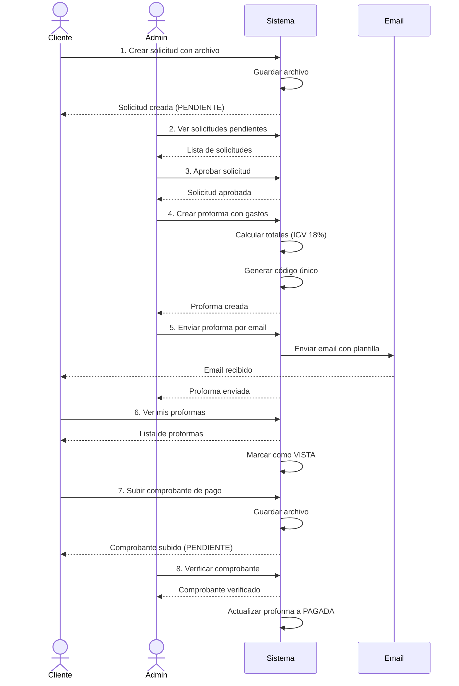

# Documentación Técnica - Sistema de Gestión para Constructora

## Índice
1. [Introducción](#introducción)
2. [Arquitectura del Sistema](#arquitectura-del-sistema)
3. [Tecnologías Utilizadas](#tecnologías-utilizadas)
4. [Estructura del Proyecto](#estructura-del-proyecto)
5. [Backend - Documentación Detallada](#backend---documentación-detallada)
6. [Frontend - Documentación Detallada](#frontend---documentación-detallada)
7. [Flujos de Trabajo](#flujos-de-trabajo)
8. [API Reference](#api-reference)
9. [Seguridad](#seguridad)
10. [Instalación y Configuración](#instalación-y-configuración)

---

## Introducción

Sistema web completo para la gestión integral de una empresa constructora que permite:
- Gestión de solicitudes de presupuesto de clientes
- Creación y envío de proformas detalladas
- Validación de comprobantes de pago
- Administración de contenido web (CMS)
- Gestión de proyectos exitosos
- Sistema de autenticación con roles diferenciados

---

## Arquitectura del Sistema

### Patrón de Diseño
- **Arquitectura**: Cliente-Servidor con separación completa
- **Backend**: API RESTful con Spring Boot
- **Frontend**: SPA con Angular + SSR
- **Base de Datos**: MySQL relacional
- **Autenticación**: JWT (JSON Web Tokens)
- **Comunicación**: HTTP/HTTPS con JSON

### Componentes Principales

```
┌─────────────────┐
│   Angular App   │ ← Cliente (Frontend)
│   (Port 4200)   │
└────────┬────────┘
         │ HTTP + JWT
         ▼
┌─────────────────┐
│  Spring Boot    │ ← Servidor (Backend)
│   (Port 8080)   │
└────────┬────────┘
         │ JPA/Hibernate
         ▼
┌─────────────────┐
│     MySQL       │ ← Base de Datos
│   (Port 3306)   │
└─────────────────┘
```

---

## Tecnologías Utilizadas

### Backend
| Tecnología | Versión | Propósito |
|------------|---------|-----------|
| Java | 17 | Lenguaje base |
| Spring Boot | 3.5.5 | Framework principal |
| Spring Security | 6.x | Seguridad y autenticación |
| Spring Data JPA | 3.x | Persistencia de datos |
| Hibernate | 6.x | ORM |
| MySQL Connector | 8.x | Driver de base de datos |
| JWT (JJWT) | 0.12.3 | Generación de tokens |
| Lombok | 1.18.x | Reducción de boilerplate |
| Thymeleaf | 3.x | Templates de email |
| Commons IO | 2.15.1 | Manejo de archivos |
| Maven | 3.6+ | Gestión de dependencias |

### Frontend
| Tecnología | Versión | Propósito |
|------------|---------|-----------|
| Angular | 19.2 | Framework SPA |
| TypeScript | 5.7 | Lenguaje tipado |
| RxJS | 7.x | Programación reactiva |
| Angular Router | 19.2 | Navegación |
| HttpClient | 19.2 | Peticiones HTTP |
| Express | 4.x | Servidor SSR |
| Node.js | 18+ | Runtime |

---

## Estructura del Proyecto

```
Constructora_web/
│
├── backend/                           # Aplicación Spring Boot
│   ├── src/main/java/com/constructora/backend/
│   │   │
│   │   ├── config/                    # Configuración
│   │   │   ├── SecurityConfig.java              (120 líneas) - Spring Security
│   │   │   ├── JwtAuthenticationFilter.java     (105 líneas) - Filtro JWT
│   │   │   ├── CorsConfig.java                  - Configuración CORS
│   │   │   ├── WebConfig.java                   - Configuración Web
│   │   │   └── AsyncConfig.java                 - Operaciones asíncronas
│   │   │
│   │   ├── controller/                # Controladores REST (6 controladores, 1753 líneas)
│   │   │   ├── AuthController.java              (175 líneas) - Autenticación
│   │   │   ├── SolicitudController.java         (332 líneas) - Solicitudes
│   │   │   ├── ProformaController.java          (276 líneas) - Proformas
│   │   │   ├── ComprobanteController.java       (286 líneas) - Comprobantes
│   │   │   ├── ContenidoController.java         (367 líneas) - CMS
│   │   │   └── FileController.java              (110 líneas) - Archivos
│   │   │
│   │   ├── entity/                    # Entidades JPA (12 entidades)
│   │   │   ├── Usuario.java                     - Entidad de usuario
│   │   │   ├── Cliente.java                     - Clase abstracta de cliente
│   │   │   ├── ClientePersonaNatural.java       - Cliente persona natural
│   │   │   ├── ClientePersonaJuridica.java      - Cliente persona jurídica
│   │   │   ├── Administrador.java               - Entidad administrador
│   │   │   ├── SolicitudProforma.java           - Solicitudes
│   │   │   ├── Proforma.java                    - Proformas
│   │   │   ├── GastoProforma.java               - Gastos de proforma
│   │   │   ├── ComprobantePago.java             - Comprobantes
│   │   │   ├── ProyectoExitoso.java             - Proyectos
│   │   │   ├── Imagen.java                      - Imágenes CMS
│   │   │   └── ImagenProyecto.java              - Imágenes de proyectos
│   │   │
│   │   ├── repository/                # Repositorios JPA (11 repositorios)
│   │   │   ├── UsuarioRepository.java
│   │   │   ├── ClienteRepository.java
│   │   │   ├── ClientePersonaNaturalRepository.java
│   │   │   ├── ClientePersonaJuridicaRepository.java
│   │   │   ├── AdministradorRepository.java
│   │   │   ├── SolicitudProformaRepository.java
│   │   │   ├── ProformaRepository.java
│   │   │   ├── GastoProformaRepository.java
│   │   │   ├── ComprobantePagoRepository.java
│   │   │   ├── ProyectoExitosoRepository.java
│   │   │   └── ImagenRepository.java
│   │   │
│   │   ├── service/                   # Servicios (9 servicios principales)
│   │   │   ├── AuthService.java                 (157 líneas) - Autenticación
│   │   │   ├── JwtService.java                  (163 líneas) - Gestión JWT
│   │   │   ├── CustomUserDetailsService.java    - UserDetails
│   │   │   ├── SolicitudProformaService.java    (122 líneas) - Lógica solicitudes
│   │   │   ├── ProformaService.java             (172 líneas) - Lógica proformas
│   │   │   ├── ComprobanteService.java          (121 líneas) - Lógica comprobantes
│   │   │   ├── ContenidoService.java            (336 líneas) - Lógica CMS
│   │   │   ├── FileStorageService.java          (186 líneas) - Almacenamiento
│   │   │   └── EmailService.java                (282 líneas) - Envío de emails
│   │   │
│   │   ├── dto/                       # DTOs (24 clases)
│   │   │   ├── ApiResponseDTO.java              - Respuesta estándar
│   │   │   ├── auth/                            - DTOs de autenticación
│   │   │   ├── solicitud/                       - DTOs de solicitudes
│   │   │   ├── proforma/                        - DTOs de proformas
│   │   │   ├── comprobante/                     - DTOs de comprobantes
│   │   │   └── contenido/                       - DTOs de contenido
│   │   │
│   │   ├── exception/                 # Excepciones (10 clases)
│   │   │   ├── GlobalExceptionHandler.java      (178 líneas) - Manejo global
│   │   │   ├── BadRequestException.java
│   │   │   ├── UnauthorizedException.java
│   │   │   ├── ForbiddenException.java
│   │   │   ├── NotFoundException.java
│   │   │   ├── ConflictException.java
│   │   │   ├── ResourceNotFoundException.java
│   │   │   ├── EmailSendingException.java
│   │   │   ├── FileStorageException.java
│   │   │   └── ErrorDetails.java
│   │   │
│   │   └── util/                      # Utilidades
│   │       └── FileUtils.java
│   │
│   ├── src/main/resources/
│   │   ├── application.properties               - Configuración principal
│   │   ├── application-dev.properties           - Configuración desarrollo
│   │   ├── application-prod.properties          - Configuración producción
│   │   └── templates/email/                     - Plantillas Thymeleaf
│   │       ├── bienvenida.html
│   │       └── proforma.html
│   │
│   ├── uploads/                       # Almacenamiento de archivos
│   │   ├── solicitudes/
│   │   ├── comprobantes/
│   │   ├── proyectos/
│   │   └── imagenes/
│   │
│   └── pom.xml                        (210 líneas) - Dependencias Maven
│
│
├── frontend/                          # Aplicación Angular
│   ├── src/
│   │   ├── app/
│   │   │   │
│   │   │   ├── components/            # Componentes (37 componentes)
│   │   │   │   │
│   │   │   │   ├── auth/              # Autenticación
│   │   │   │   │   ├── login/
│   │   │   │   │   ├── register/
│   │   │   │   │   └── registro-tipo/
│   │   │   │   │
│   │   │   │   ├── public/            # Componentes públicos (9 componentes)
│   │   │   │   │   ├── public-layout/
│   │   │   │   │   ├── home/
│   │   │   │   │   ├── navbar/
│   │   │   │   │   ├── footer/
│   │   │   │   │   ├── hero-section/
│   │   │   │   │   ├── proyectos/
│   │   │   │   │   ├── servicios/
│   │   │   │   │   ├── sobre-nosotros/
│   │   │   │   │   └── contacto/
│   │   │   │   │
│   │   │   │   ├── admin/             # Panel Admin (11 componentes)
│   │   │   │   │   ├── admin-layout/
│   │   │   │   │   ├── admin-dashboard/
│   │   │   │   │   ├── solicitudes-list/
│   │   │   │   │   ├── solicitud-detail/
│   │   │   │   │   ├── crear-proforma/
│   │   │   │   │   ├── proformas-list/
│   │   │   │   │   ├── comprobantes-list/
│   │   │   │   │   ├── contenido-web/
│   │   │   │   │   ├── proyectos-list/
│   │   │   │   │   └── crear-proyecto/
│   │   │   │   │
│   │   │   │   ├── cliente/           # Panel Cliente (7 componentes)
│   │   │   │   │   ├── cliente-layout/
│   │   │   │   │   ├── cliente-dashboard/
│   │   │   │   │   ├── nueva-solicitud/
│   │   │   │   │   ├── mis-solicitudes/
│   │   │   │   │   ├── mis-proformas/
│   │   │   │   │   ├── proforma-detail/
│   │   │   │   │   └── subir-comprobante/
│   │   │   │   │
│   │   │   │   └── shared/            # Componentes compartidos (5 componentes)
│   │   │   │       ├── alert/
│   │   │   │       ├── confirmation-dialog/
│   │   │   │       ├── estado-badge/
│   │   │   │       ├── file-upload/
│   │   │   │       └── loading-spinner/
│   │   │   │
│   │   │   ├── services/              # Servicios (9 servicios)
│   │   │   │   ├── auth.service.ts              (256 líneas)
│   │   │   │   ├── solicitud.service.ts         (75 líneas)
│   │   │   │   ├── proforma.service.ts          (80 líneas)
│   │   │   │   ├── comprobante.service.ts
│   │   │   │   ├── contenido.service.ts         (55 líneas)
│   │   │   │   ├── proyecto.service.ts
│   │   │   │   ├── loading.service.ts           (37 líneas)
│   │   │   │   ├── notification.service.ts      (36 líneas)
│   │   │   │   └── file.service.ts
│   │   │   │
│   │   │   ├── guards/                # Guards de seguridad (3 guards)
│   │   │   │   ├── auth.guard.ts                (23 líneas)
│   │   │   │   ├── admin.guard.ts               (27 líneas)
│   │   │   │   └── cliente.guard.ts
│   │   │   │
│   │   │   ├── interceptors/          # Interceptores HTTP (3 interceptors)
│   │   │   │   ├── auth.interceptor.ts          (36 líneas)
│   │   │   │   ├── error.interceptor.ts         (62 líneas)
│   │   │   │   └── loading.interceptor.ts       (22 líneas)
│   │   │   │
│   │   │   ├── models/                # Modelos TypeScript
│   │   │   │   ├── api.models.ts
│   │   │   │   ├── auth.models.ts
│   │   │   │   ├── solicitud.models.ts
│   │   │   │   ├── proforma.models.ts
│   │   │   │   ├── comprobante.models.ts
│   │   │   │   ├── contenido.models.ts
│   │   │   │   └── cliente.models.ts
│   │   │   │
│   │   │   ├── constants/             # Constantes
│   │   │   │   ├── app-constants.ts             (64 líneas)
│   │   │   │   ├── api-endpoints.ts             (73 líneas)
│   │   │   │   └── estados.constants.ts         (89 líneas)
│   │   │   │
│   │   │   ├── app.config.ts          # Configuración de la app
│   │   │   └── app.routes.ts          (185 líneas) - Rutas
│   │   │
│   │   ├── assets/                    # Recursos estáticos
│   │   │   ├── images/
│   │   │   ├── icons/
│   │   │   └── styles/
│   │   │
│   │   └── environments/              # Configuración de entornos
│   │       ├── environment.ts
│   │       └── environment.prod.ts
│   │
│   ├── server.ts                      # Servidor SSR
│   ├── package.json                   # Dependencias npm
│   ├── tsconfig.json                  # Configuración TypeScript
│   └── angular.json                   # Configuración Angular
│
├── README.md                          # Documentación principal
├── DOCUMENTACION_TECNICA.md           # Esta documentación
└── .gitignore
```

---

## Backend - Documentación Detallada

### 1. Entidades y Modelo de Datos

#### 1.1 Usuario (Usuario.java)
Entidad base para todos los usuarios del sistema.

```java
@Entity
public class Usuario {
    @Id
    @GeneratedValue(strategy = GenerationType.IDENTITY)
    private Long id;

    @Column(unique = true, nullable = false)
    private String correoElectronico;

    @Column(nullable = false)
    private String contrasena; // BCrypt encrypted

    @Enumerated(EnumType.STRING)
    @Column(nullable = false)
    private TipoUsuario tipoUsuario;

    private Boolean activo = true;
    private LocalDateTime fechaCreacion;
    private LocalDateTime ultimoAcceso;
}

enum TipoUsuario {
    CLIENTE_NATURAL,
    CLIENTE_JURIDICO,
    ADMINISTRADOR
}
```

**Relaciones:**
- OneToOne con Cliente o Administrador

#### 1.2 Cliente (Cliente.java)
Clase abstracta con herencia JOINED.

```java
@Entity
@Inheritance(strategy = InheritanceType.JOINED)
public abstract class Cliente {
    @Id
    @GeneratedValue(strategy = GenerationType.IDENTITY)
    private Long id;

    @OneToOne
    @JoinColumn(name = "usuario_id")
    private Usuario usuario;

    private String telefono;
    private String direccion;
    private LocalDateTime fechaRegistro;

    @OneToMany(mappedBy = "cliente")
    private List<SolicitudProforma> solicitudes;

    @OneToMany(mappedBy = "cliente")
    private List<Proforma> proformas;
}
```

**Clases hijas:**

**ClientePersonaNatural:**
```java
@Entity
public class ClientePersonaNatural extends Cliente {
    private String nombres;
    private String apellidos;

    @Column(unique = true, length = 8)
    private String dni;

    private LocalDate fechaNacimiento;
}
```

**ClientePersonaJuridica:**
```java
@Entity
public class ClientePersonaJuridica extends Cliente {
    private String razonSocial;

    @Column(unique = true, length = 11)
    private String ruc;

    private String representanteLegal;
}
```

#### 1.3 SolicitudProforma (SolicitudProforma.java)
Solicitudes de presupuesto realizadas por clientes.

```java
@Entity
public class SolicitudProforma {
    @Id
    @GeneratedValue(strategy = GenerationType.IDENTITY)
    private Long id;

    @ManyToOne
    @JoinColumn(name = "cliente_id")
    private Cliente cliente;

    private String titulo;

    @Column(columnDefinition = "TEXT")
    private String descripcion;

    private String archivoAdjunto; // Ruta del archivo

    @Enumerated(EnumType.STRING)
    private EstadoSolicitud estado;

    @Column(columnDefinition = "TEXT")
    private String motivoRechazo;

    private LocalDateTime fechaSolicitud;
    private LocalDateTime fechaRevision;

    @ManyToOne
    @JoinColumn(name = "revisado_por")
    private Administrador revisadoPor;

    @OneToOne(mappedBy = "solicitud")
    private Proforma proforma;
}

enum EstadoSolicitud {
    PENDIENTE,
    EN_REVISION,
    APROBADA,
    RECHAZADA
}
```

#### 1.4 Proforma (Proforma.java)
Presupuestos generados por administradores.

```java
@Entity
public class Proforma {
    @Id
    @GeneratedValue(strategy = GenerationType.IDENTITY)
    private Long id;

    @OneToOne
    @JoinColumn(name = "solicitud_id")
    private SolicitudProforma solicitud;

    @Column(unique = true)
    private String codigo; // PRF-YYYYMMDD-XXX

    @ManyToOne
    @JoinColumn(name = "cliente_id")
    private Cliente cliente;

    @Column(precision = 10, scale = 2)
    private BigDecimal subtotal;

    @Column(precision = 10, scale = 2)
    private BigDecimal igv; // 18%

    @Column(precision = 10, scale = 2)
    private BigDecimal total;

    private LocalDate vigenciaHasta;

    @Column(columnDefinition = "TEXT")
    private String observaciones;

    @Enumerated(EnumType.STRING)
    private EstadoProforma estado;

    @ManyToOne
    @JoinColumn(name = "creado_por")
    private Administrador creadoPor;

    @OneToMany(mappedBy = "proforma", cascade = CascadeType.ALL)
    private List<GastoProforma> gastos;

    @OneToMany(mappedBy = "proforma")
    private List<ComprobantePago> comprobantes;

    private LocalDateTime fechaCreacion;
    private LocalDateTime fechaEnvio;
}

enum EstadoProforma {
    ENVIADA,
    VISTA,
    ACEPTADA,
    RECHAZADA,
    PAGADA
}
```

#### 1.5 GastoProforma (GastoProforma.java)
Líneas de detalle de una proforma.

```java
@Entity
public class GastoProforma {
    @Id
    @GeneratedValue(strategy = GenerationType.IDENTITY)
    private Long id;

    @ManyToOne
    @JoinColumn(name = "proforma_id")
    private Proforma proforma;

    private String concepto;

    @Column(columnDefinition = "TEXT")
    private String descripcion;

    private Integer cantidad;
    private String unidad; // m2, ml, unidad, etc.

    @Column(precision = 10, scale = 2)
    private BigDecimal precioUnitario;

    @Column(precision = 10, scale = 2)
    private BigDecimal subtotal; // cantidad * precioUnitario

    private Integer orden;
}
```

#### 1.6 ComprobantePago (ComprobantePago.java)
Comprobantes subidos por clientes.

```java
@Entity
public class ComprobantePago {
    @Id
    @GeneratedValue(strategy = GenerationType.IDENTITY)
    private Long id;

    @ManyToOne
    @JoinColumn(name = "proforma_id")
    private Proforma proforma;

    @ManyToOne
    @JoinColumn(name = "cliente_id")
    private Cliente cliente;

    @Column(precision = 10, scale = 2)
    private BigDecimal monto;

    private String numeroOperacion;
    private String entidadBancaria;
    private String archivoComprobante; // Ruta

    @Enumerated(EnumType.STRING)
    private EstadoComprobante estado;

    @Column(columnDefinition = "TEXT")
    private String observaciones;

    private LocalDateTime fechaSubida;

    @ManyToOne
    @JoinColumn(name = "verificado_por")
    private Administrador verificadoPor;

    private LocalDateTime fechaVerificacion;
}

enum EstadoComprobante {
    PENDIENTE,
    VERIFICADO,
    RECHAZADO
}
```

### 2. Controladores REST

#### 2.1 AuthController (AuthController.java)

**Base Path:** `/api/auth`

**Endpoints:**

| Método | Ruta | Descripción | Acceso |
|--------|------|-------------|--------|
| POST | `/login` | Iniciar sesión | Público |
| POST | `/registro/persona-natural` | Registrar persona natural | Público |
| POST | `/registro/persona-juridica` | Registrar persona jurídica | Público |
| GET | `/validate` | Validar token JWT | Autenticado |
| GET | `/check-email?email=...` | Verificar disponibilidad de email | Público |
| GET | `/check-dni?dni=...` | Verificar disponibilidad de DNI | Público |
| GET | `/check-ruc?ruc=...` | Verificar disponibilidad de RUC | Público |

**Ejemplo de Login:**
```java
POST /api/auth/login
Request:
{
    "correoElectronico": "cliente@example.com",
    "contrasena": "password123"
}

Response:
{
    "success": true,
    "message": "Login exitoso",
    "data": {
        "token": "eyJhbGciOiJIUzI1NiIsInR5cCI6IkpXVCJ9...",
        "tipoUsuario": "CLIENTE_NATURAL",
        "correoElectronico": "cliente@example.com",
        "nombreCompleto": "Juan Pérez"
    },
    "timestamp": "2025-01-18T10:30:00"
}
```

#### 2.2 SolicitudController (SolicitudController.java)

**Base Path:** `/api/solicitudes`

**Endpoints de Cliente:**

| Método | Ruta | Descripción | Rol |
|--------|------|-------------|-----|
| POST | `/` | Crear solicitud | Cliente |
| GET | `/mis-solicitudes` | Obtener mis solicitudes | Cliente |
| GET | `/{id}` | Obtener solicitud por ID | Cliente (propia) |

**Endpoints de Administrador:**

| Método | Ruta | Descripción | Rol |
|--------|------|-------------|-----|
| GET | `/admin/todas?estado=PENDIENTE` | Listar todas las solicitudes | Admin |
| PATCH | `/{id}/estado` | Cambiar estado | Admin |
| POST | `/{id}/aprobar` | Aprobar solicitud | Admin |
| POST | `/{id}/rechazar?motivo=...` | Rechazar solicitud | Admin |
| GET | `/admin/pendientes/count` | Contar pendientes | Admin |

**Ejemplo de Creación:**
```java
POST /api/solicitudes
Content-Type: multipart/form-data

titulo: "Construcción de casa"
descripcion: "Necesito presupuesto para construcción..."
archivo: [file]

Response:
{
    "success": true,
    "message": "Solicitud creada exitosamente",
    "data": {
        "id": 1,
        "titulo": "Construcción de casa",
        "descripcion": "Necesito presupuesto...",
        "estado": "PENDIENTE",
        "fechaSolicitud": "2025-01-18T10:30:00",
        "archivoAdjunto": "uploads/solicitudes/uuid_archivo.pdf"
    }
}
```

#### 2.3 ProformaController (ProformaController.java)

**Base Path:** `/api/proformas`

**Endpoints principales:**

| Método | Ruta | Descripción | Rol |
|--------|------|-------------|-----|
| POST | `/` | Crear proforma | Admin |
| POST | `/{id}/enviar` | Enviar por email | Admin |
| GET | `/admin/todas?estado=ENVIADA` | Listar todas | Admin |
| GET | `/{id}` | Obtener por ID | Cliente/Admin |
| GET | `/codigo/{codigo}` | Obtener por código | Cliente/Admin |
| GET | `/mis-proformas` | Mis proformas | Cliente |
| POST | `/{id}/marcar-vista` | Marcar como vista | Cliente |
| GET | `/admin/estadisticas` | Estadísticas | Admin |

**Ejemplo de Creación:**
```java
POST /api/proformas
{
    "solicitudId": 1,
    "vigenciaHasta": "2025-02-18",
    "observaciones": "Válido hasta la fecha indicada",
    "gastos": [
        {
            "concepto": "Mano de obra",
            "descripcion": "Construcción de estructura",
            "cantidad": 100,
            "unidad": "m2",
            "precioUnitario": 150.00,
            "orden": 1
        },
        {
            "concepto": "Materiales",
            "descripcion": "Cemento, fierro, etc.",
            "cantidad": 1,
            "unidad": "global",
            "precioUnitario": 5000.00,
            "orden": 2
        }
    ]
}

Response:
{
    "success": true,
    "message": "Proforma creada exitosamente",
    "data": {
        "id": 1,
        "codigo": "PRF-20250118-001",
        "subtotal": 20000.00,
        "igv": 3600.00,
        "total": 23600.00,
        "vigenciaHasta": "2025-02-18",
        "estado": "ENVIADA",
        "gastos": [...]
    }
}
```

### 3. Servicios

#### 3.1 JwtService (JwtService.java)

**Responsabilidades:**
- Generación de tokens JWT
- Validación de tokens
- Extracción de claims

**Métodos principales:**
```java
public String generateToken(Usuario usuario)
public String extractUserId(String token)
public String extractTipoUsuario(String token)
public boolean isTokenValid(String token)
public boolean isTokenExpired(String token)
public String refreshToken(String token)
```

**Configuración:**
```properties
jwt.secret=tu_clave_secreta_aqui_minimo_256_bits
jwt.expiration=86400000  # 24 horas en milisegundos
```

**Estructura del Token:**
```json
{
  "sub": "123",  // userId
  "email": "usuario@example.com",
  "tipo": "CLIENTE_NATURAL",
  "iat": 1642517234,
  "exp": 1642603634
}
```

#### 3.2 FileStorageService (FileStorageService.java)

**Responsabilidades:**
- Almacenamiento de archivos
- Validación de tipos y tamaños
- Generación de nombres únicos

**Métodos:**
```java
public String storeFile(MultipartFile file, String directory)
public Resource loadFileAsResource(String fileName, String directory)
public void deleteFile(String fileName, String directory)
```

**Estructura de directorios:**
```
uploads/
├── solicitudes/     # Archivos adjuntos de solicitudes
├── comprobantes/    # Comprobantes de pago
├── proyectos/       # Imágenes de proyectos
└── imagenes/        # Imágenes del CMS
```

**Validaciones:**
- Tamaño máximo: 10 MB
- Tipos permitidos: JPEG, JPG, PNG, WEBP, PDF
- Nombres únicos: `UUID_timestamp_originalname.ext`

#### 3.3 EmailService (EmailService.java)

**Responsabilidades:**
- Envío de correos con plantillas HTML
- Email de bienvenida
- Email de proforma

**Métodos:**
```java
public void enviarEmailBienvenida(String destinatario, String nombre)
public void enviarProformaPorEmail(Proforma proforma)
```

**Plantillas Thymeleaf:**

**bienvenida.html:**
```html
<!DOCTYPE html>
<html xmlns:th="http://www.thymeleaf.org">
<body>
    <h1>Bienvenido [[${nombre}]]</h1>
    <p>Tu cuenta ha sido creada exitosamente.</p>
</body>
</html>
```

**proforma.html:**
```html
<!DOCTYPE html>
<html xmlns:th="http://www.thymeleaf.org">
<body>
    <h1>Proforma [[${proforma.codigo}]]</h1>
    <table>
        <tr th:each="gasto : ${proforma.gastos}">
            <td th:text="${gasto.concepto}"></td>
            <td th:text="${gasto.subtotal}"></td>
        </tr>
    </table>
    <p>Total: S/ [[${proforma.total}]]</p>
</body>
</html>
```

### 4. Configuración de Seguridad

#### 4.1 SecurityConfig (SecurityConfig.java)

**Configuración de rutas:**

```java
@Bean
public SecurityFilterChain filterChain(HttpSecurity http) {
    http
        .csrf(csrf -> csrf.disable())
        .sessionManagement(session ->
            session.sessionCreationPolicy(SessionCreationPolicy.STATELESS))
        .authorizeHttpRequests(auth -> auth
            // Rutas públicas
            .requestMatchers("/api/auth/**").permitAll()
            .requestMatchers("/api/contenido/imagenes/publico/**").permitAll()
            .requestMatchers("/api/contenido/proyectos/publico/**").permitAll()
            .requestMatchers("/api/files/public/**").permitAll()

            // Rutas de administrador
            .requestMatchers("/api/admin/**").hasAuthority("ADMINISTRADOR")
            .requestMatchers("/api/contenido/**").hasAuthority("ADMINISTRADOR")
            .requestMatchers("/api/solicitudes/admin/**").hasAuthority("ADMINISTRADOR")

            // Rutas de cliente
            .requestMatchers("/api/solicitudes/mis-solicitudes").hasAnyAuthority("CLIENTE_NATURAL", "CLIENTE_JURIDICO")
            .requestMatchers("/api/proformas/mis-proformas").hasAnyAuthority("CLIENTE_NATURAL", "CLIENTE_JURIDICO")

            .anyRequest().authenticated()
        )
        .addFilterBefore(jwtAuthenticationFilter, UsernamePasswordAuthenticationFilter.class);
}
```

#### 4.2 JwtAuthenticationFilter (JwtAuthenticationFilter.java)

**Flujo del filtro:**

```
Request → JwtAuthenticationFilter
    ↓
Extraer header "Authorization"
    ↓
¿Contiene "Bearer "?
    ├─ No → Continuar sin autenticación
    └─ Sí → Extraer token
         ↓
    ¿Token válido?
         ├─ No → Rechazar (401)
         └─ Sí → Extraer userId
              ↓
         Cargar UserDetails
              ↓
         Establecer SecurityContext
              ↓
         Continuar con la petición
```

**Implementación:**
```java
@Override
protected void doFilterInternal(HttpServletRequest request,
                                HttpServletResponse response,
                                FilterChain filterChain) {
    String authHeader = request.getHeader("Authorization");

    if (authHeader != null && authHeader.startsWith("Bearer ")) {
        String token = authHeader.substring(7);

        if (jwtService.isTokenValid(token)) {
            String userId = jwtService.extractUserId(token);
            UserDetails userDetails = userDetailsService.loadUserByUsername(userId);

            UsernamePasswordAuthenticationToken authentication =
                new UsernamePasswordAuthenticationToken(
                    userDetails, null, userDetails.getAuthorities()
                );

            SecurityContextHolder.getContext().setAuthentication(authentication);
        }
    }

    filterChain.doFilter(request, response);
}
```

---

## Frontend - Documentación Detallada

### 1. Arquitectura de Componentes

#### 1.1 Jerarquía de Layouts

```
App
├── PublicLayout (navbar + footer)
│   ├── Home
│   ├── Proyectos
│   └── Contacto
│
├── AdminLayout (sidebar + header)
│   ├── AdminDashboard
│   ├── SolicitudesList
│   ├── ProformasList
│   └── ComprobantesListst
│
└── ClienteLayout (sidebar + header)
    ├── ClienteDashboard
    ├── MisSolicitudes
    └── MisProformas
```

### 2. Guards de Seguridad

#### 2.1 authGuard (auth.guard.ts)

```typescript
export const authGuard: CanActivateFn = (route, state) => {
  const authService = inject(AuthService);
  const router = inject(Router);

  if (authService.isAuthenticated()) {
    return true;
  }

  // Guardar URL intentada para redirección posterior
  router.navigate(['/login'], {
    queryParams: { returnUrl: state.url }
  });
  return false;
};
```

#### 2.2 adminGuard (admin.guard.ts)

```typescript
export const adminGuard: CanActivateFn = (route, state) => {
  const authService = inject(AuthService);
  const router = inject(Router);

  if (!authService.isAuthenticated()) {
    router.navigate(['/login']);
    return false;
  }

  if (authService.isAdmin()) {
    return true;
  }

  // Redirigir según el rol
  if (authService.isCliente()) {
    router.navigate(['/cliente/dashboard']);
  }

  return false;
};
```

### 3. Interceptores HTTP

#### 3.1 authInterceptor (auth.interceptor.ts)

**Propósito:** Agregar token JWT automáticamente a las peticiones.

```typescript
export const authInterceptor: HttpInterceptorFn = (req, next) => {
  const authService = inject(AuthService);

  // Rutas que no requieren autenticación
  const publicRoutes = ['/api/auth/', '/api/contenido/publico', '/api/files/public'];

  const isPublicRoute = publicRoutes.some(route => req.url.includes(route));

  if (!isPublicRoute && authService.isAuthenticated()) {
    const token = authService.getToken();

    req = req.clone({
      setHeaders: {
        Authorization: `Bearer ${token}`
      }
    });
  }

  return next(req);
};
```

#### 3.2 errorInterceptor (error.interceptor.ts)

**Propósito:** Manejo centralizado de errores HTTP.

```typescript
export const errorInterceptor: HttpInterceptorFn = (req, next) => {
  const authService = inject(AuthService);
  const router = inject(Router);
  const notificationService = inject(NotificationService);

  return next(req).pipe(
    catchError((error: HttpErrorResponse) => {
      let errorMessage = 'Ha ocurrido un error';

      if (error.status === 401) {
        // Token expirado o inválido
        authService.logout();
        router.navigate(['/login']);
        errorMessage = 'Sesión expirada. Por favor, inicie sesión nuevamente.';
      } else if (error.status === 403) {
        errorMessage = 'No tiene permisos para realizar esta acción';
      } else if (error.status === 404) {
        errorMessage = 'Recurso no encontrado';
      } else if (error.error?.message) {
        errorMessage = error.error.message;
      }

      notificationService.showError(errorMessage);

      return throwError(() => error);
    })
  );
};
```

### 4. Servicios

#### 4.1 AuthService (auth.service.ts)

**Métodos principales:**

```typescript
export class AuthService {
  private apiUrl = environment.apiUrl + '/api/auth';
  private tokenKey = STORAGE_KEYS.TOKEN;
  private userKey = STORAGE_KEYS.USER;

  // BehaviorSubjects para estado reactivo
  private authStatusSubject = new BehaviorSubject<boolean>(this.hasToken());
  public authStatus$ = this.authStatusSubject.asObservable();

  /**
   * Iniciar sesión
   */
  login(credentials: LoginRequest): Observable<ApiResponse<LoginResponse>> {
    return this.http.post<ApiResponse<LoginResponse>>(
      `${this.apiUrl}/login`,
      credentials
    ).pipe(
      tap(response => {
        if (response.success && response.data) {
          this.setSession(response.data);
        }
      })
    );
  }

  /**
   * Registrar persona natural
   */
  registrarPersonaNatural(data: RegistroPersonaNatural): Observable<ApiResponse<any>> {
    return this.http.post<ApiResponse<any>>(
      `${this.apiUrl}/registro/persona-natural`,
      data
    );
  }

  /**
   * Validación asíncrona de email
   */
  checkEmailAvailability(email: string): Observable<boolean> {
    return this.http.get<ApiResponse<boolean>>(
      `${this.apiUrl}/check-email`,
      { params: { email } }
    ).pipe(
      map(response => response.data),
      catchError(() => of(false))
    );
  }

  /**
   * Verificar autenticación
   */
  isAuthenticated(): boolean {
    if (!this.isBrowser()) return false;
    return this.hasToken() && !this.isTokenExpired();
  }

  /**
   * Verificar si es administrador
   */
  isAdmin(): boolean {
    return this.getUserType() === ROLES.ADMIN;
  }

  /**
   * Cerrar sesión
   */
  logout(): void {
    if (this.isBrowser()) {
      sessionStorage.removeItem(this.tokenKey);
      sessionStorage.removeItem(this.userKey);
      sessionStorage.removeItem(STORAGE_KEYS.USER_TYPE);
      this.authStatusSubject.next(false);
    }
  }

  /**
   * Guardar sesión
   */
  private setSession(authResult: LoginResponse): void {
    if (this.isBrowser()) {
      sessionStorage.setItem(this.tokenKey, authResult.token);
      sessionStorage.setItem(this.userKey, JSON.stringify({
        correo: authResult.correoElectronico,
        nombre: authResult.nombreCompleto,
        tipo: authResult.tipoUsuario
      }));
      sessionStorage.setItem(STORAGE_KEYS.USER_TYPE, authResult.tipoUsuario);
      this.authStatusSubject.next(true);
    }
  }

  /**
   * Verificar si estamos en el navegador (para SSR)
   */
  private isBrowser(): boolean {
    return typeof window !== 'undefined' && typeof sessionStorage !== 'undefined';
  }
}
```

#### 4.2 SolicitudService (solicitud.service.ts)

```typescript
export class SolicitudService {
  private apiUrl = environment.apiUrl + API_ENDPOINTS.solicitudes.base;

  /**
   * Crear solicitud con archivo
   */
  crearSolicitud(formData: FormData): Observable<ApiResponse<SolicitudProforma>> {
    return this.http.post<ApiResponse<SolicitudProforma>>(
      this.apiUrl,
      formData
    );
  }

  /**
   * Obtener mis solicitudes (cliente)
   */
  obtenerMisSolicitudes(): Observable<ApiResponse<SolicitudProforma[]>> {
    return this.http.get<ApiResponse<SolicitudProforma[]>>(
      API_ENDPOINTS.solicitudes.misSolicitudes()
    );
  }

  /**
   * Aprobar solicitud (admin)
   */
  aprobarSolicitud(id: number): Observable<ApiResponse<SolicitudProforma>> {
    return this.http.post<ApiResponse<SolicitudProforma>>(
      API_ENDPOINTS.solicitudes.aprobar(id),
      {}
    );
  }
}
```

### 5. Modelos TypeScript

#### 5.1 API Response (api.models.ts)

```typescript
export interface ApiResponse<T> {
  success: boolean;
  message: string;
  data: T;
  timestamp?: string;
}
```

#### 5.2 Solicitud (solicitud.models.ts)

```typescript
export enum EstadoSolicitud {
  PENDIENTE = 'PENDIENTE',
  EN_REVISION = 'EN_REVISION',
  APROBADA = 'APROBADA',
  RECHAZADA = 'RECHAZADA'
}

export interface SolicitudProforma {
  id: number;
  clienteId: number;
  clienteNombre: string;
  titulo: string;
  descripcion: string;
  archivoAdjunto?: string;
  estado: EstadoSolicitud;
  motivoRechazo?: string;
  fechaSolicitud: string;
  fechaRevision?: string;
  revisadoPor?: string;
}

export interface CrearSolicitudRequest {
  titulo: string;
  descripcion: string;
  archivo?: File;
}
```

#### 5.3 Proforma (proforma.models.ts)

```typescript
export enum EstadoProforma {
  ENVIADA = 'ENVIADA',
  VISTA = 'VISTA',
  ACEPTADA = 'ACEPTADA',
  RECHAZADA = 'RECHAZADA',
  PAGADA = 'PAGADA'
}

export interface Proforma {
  id: number;
  codigo: string;
  solicitudId: number;
  clienteId: number;
  clienteNombre: string;
  subtotal: number;
  igv: number;
  total: number;
  vigenciaHasta: string;
  observaciones?: string;
  estado: EstadoProforma;
  gastos: GastoProforma[];
  fechaCreacion: string;
  fechaEnvio?: string;
}

export interface GastoProforma {
  id?: number;
  concepto: string;
  descripcion: string;
  cantidad: number;
  unidad: string;
  precioUnitario: number;
  subtotal: number;
  orden: number;
}

export interface CrearProformaRequest {
  solicitudId: number;
  vigenciaHasta: string;
  observaciones?: string;
  gastos: Omit<GastoProforma, 'id'>[];
}
```

### 6. Rutas (app.routes.ts)

```typescript
export const routes: Routes = [
  // Rutas públicas
  {
    path: '',
    component: PublicLayoutComponent,
    children: [
      { path: '', component: HomeComponent },
      { path: 'proyectos', component: ProyectosComponent },
      { path: 'servicios', component: ServiciosComponent },
      { path: 'contacto', component: ContactoComponent }
    ]
  },

  // Autenticación
  { path: 'login', component: LoginComponent },
  { path: 'registro-tipo', component: RegistroTipoComponent },
  { path: 'register/:tipo', component: RegisterComponent },

  // Rutas de administrador
  {
    path: 'admin',
    component: AdminLayoutComponent,
    canActivate: [authGuard, adminGuard],
    children: [
      { path: 'dashboard', component: AdminDashboardComponent },
      { path: 'solicitudes', component: SolicitudesListComponent },
      { path: 'solicitudes/:id', component: SolicitudDetailComponent },
      { path: 'crear-proforma/:solicitudId', component: CrearProformaComponent },
      { path: 'proformas', component: ProformasListComponent },
      { path: 'comprobantes', component: ComprobantesListComponent },
      { path: 'contenido', component: ContenidoWebComponent },
      { path: 'proyectos', component: ProyectosListComponent },
      { path: 'crear-proyecto', component: CrearProyectoComponent }
    ]
  },

  // Rutas de cliente
  {
    path: 'cliente',
    component: ClienteLayoutComponent,
    canActivate: [authGuard, clienteGuard],
    children: [
      { path: 'dashboard', component: ClienteDashboardComponent },
      { path: 'nueva-solicitud', component: NuevaSolicitudComponent },
      { path: 'mis-solicitudes', component: MisSolicitudesComponent },
      { path: 'mis-proformas', component: MisProformasComponent },
      { path: 'proforma/:id', component: ProformaDetailComponent },
      { path: 'subir-comprobante/:proformaId', component: SubirComprobanteComponent }
    ]
  },

  // Redirección por defecto
  { path: '**', redirectTo: '' }
];
```

### 7. Constantes

#### 7.1 app-constants.ts

```typescript
export const STORAGE_KEYS = {
  TOKEN: 'auth_token',
  USER: 'current_user',
  USER_TYPE: 'user_type'
} as const;

export const ROLES = {
  ADMIN: 'ADMINISTRADOR',
  CLIENTE_NATURAL: 'CLIENTE_NATURAL',
  CLIENTE_JURIDICO: 'CLIENTE_JURIDICO'
} as const;

export const VALIDATION = {
  DNI_LENGTH: 8,
  RUC_LENGTH: 11,
  PHONE_LENGTH: 9,
  PASSWORD_MIN_LENGTH: 6,
  MAX_FILE_SIZE: 10 * 1024 * 1024, // 10MB
  ALLOWED_FILE_TYPES: ['image/jpeg', 'image/jpg', 'image/png', 'application/pdf']
} as const;

export const MESSAGES = {
  SUCCESS: {
    LOGIN: 'Inicio de sesión exitoso',
    REGISTRO: 'Registro exitoso',
    SOLICITUD_CREADA: 'Solicitud creada exitosamente',
    PROFORMA_CREADA: 'Proforma creada exitosamente'
  },
  ERROR: {
    GENERIC: 'Ha ocurrido un error',
    LOGIN_FAILED: 'Credenciales inválidas',
    SESSION_EXPIRED: 'Sesión expirada'
  }
} as const;
```

#### 7.2 api-endpoints.ts

```typescript
export const API_ENDPOINTS = {
  auth: {
    base: '/api/auth',
    login: () => '/api/auth/login',
    registroNatural: () => '/api/auth/registro/persona-natural',
    registroJuridico: () => '/api/auth/registro/persona-juridica',
    checkEmail: (email: string) => `/api/auth/check-email?email=${email}`,
    checkDni: (dni: string) => `/api/auth/check-dni?dni=${dni}`,
    checkRuc: (ruc: string) => `/api/auth/check-ruc?ruc=${ruc}`
  },

  solicitudes: {
    base: '/api/solicitudes',
    misSolicitudes: () => '/api/solicitudes/mis-solicitudes',
    porId: (id: number) => `/api/solicitudes/${id}`,
    aprobar: (id: number) => `/api/solicitudes/${id}/aprobar`,
    rechazar: (id: number, motivo: string) =>
      `/api/solicitudes/${id}/rechazar?motivo=${encodeURIComponent(motivo)}`,
    adminTodas: (estado?: string) =>
      `/api/solicitudes/admin/todas${estado ? '?estado=' + estado : ''}`,
    pendientesCount: () => '/api/solicitudes/admin/pendientes/count'
  },

  proformas: {
    base: '/api/proformas',
    misProformas: () => '/api/proformas/mis-proformas',
    porId: (id: number) => `/api/proformas/${id}`,
    porCodigo: (codigo: string) => `/api/proformas/codigo/${codigo}`,
    enviar: (id: number) => `/api/proformas/${id}/enviar`,
    marcarVista: (id: number) => `/api/proformas/${id}/marcar-vista`,
    estadisticas: () => '/api/proformas/admin/estadisticas'
  },

  comprobantes: {
    base: '/api/comprobantes',
    misComprobantes: () => '/api/comprobantes/mis-comprobantes',
    porId: (id: number) => `/api/comprobantes/${id}`,
    verificar: (id: number) => `/api/comprobantes/${id}/verificar`,
    rechazar: (id: number) => `/api/comprobantes/${id}/rechazar`
  }
} as const;
```

---

## Flujos de Trabajo

### 1. Flujo Completo: Solicitud → Proforma → Pago



### 2. Flujo de Autenticación

```
┌────────────┐
│  Usuario   │
└─────┬──────┘
      │
      │ 1. Accede a /login
      ▼
┌─────────────────┐
│ LoginComponent  │
└─────┬───────────┘
      │
      │ 2. Ingresa credenciales
      ▼
┌─────────────────┐
│  AuthService    │
└─────┬───────────┘
      │
      │ 3. POST /api/auth/login
      ▼
┌──────────────────┐
│ AuthController   │
└─────┬────────────┘
      │
      │ 4. Valida con Spring Security
      ▼
┌──────────────────┐
│   AuthService    │ (Backend)
│  (loadUserByUsername)
└─────┬────────────┘
      │
      │ 5. Genera JWT
      ▼
┌──────────────────┐
│   JwtService     │
└─────┬────────────┘
      │
      │ 6. Retorna token
      ▼
┌──────────────────┐
│  AuthService     │ (Frontend)
│  setSession()    │
└─────┬────────────┘
      │
      │ 7. Guarda en sessionStorage
      │    - auth_token
      │    - current_user
      │    - user_type
      ▼
┌──────────────────┐
│   Router         │
│   Redirige según rol:
│   - Admin → /admin/dashboard
│   - Cliente → /cliente/dashboard
└──────────────────┘
```

### 3. Flujo de Solicitud (Cliente)

```
┌─────────────────────────────┐
│ NuevaSolicitudComponent     │
└──────────────┬──────────────┘
               │
               │ FormData con:
               │ - titulo
               │ - descripcion
               │ - archivo (File)
               ▼
┌─────────────────────────────┐
│    SolicitudService         │
│    crearSolicitud()         │
└──────────────┬──────────────┘
               │
               │ POST /api/solicitudes
               │ Content-Type: multipart/form-data
               ▼
┌─────────────────────────────┐
│   SolicitudController       │
│   @PostMapping("/")         │
└──────────────┬──────────────┘
               │
               │ 1. Valida archivo
               │ 2. Guarda archivo
               ▼
┌─────────────────────────────┐
│   FileStorageService        │
│   storeFile()               │
└──────────────┬──────────────┘
               │
               │ Retorna ruta:
               │ uploads/solicitudes/uuid_archivo.pdf
               ▼
┌─────────────────────────────┐
│ SolicitudProformaService    │
│ crearSolicitud()            │
└──────────────┬──────────────┘
               │
               │ 1. Crea entidad
               │ 2. Asocia con cliente
               │ 3. Estado = PENDIENTE
               ▼
┌─────────────────────────────┐
│ SolicitudProformaRepository │
│ save()                      │
└──────────────┬──────────────┘
               │
               │ Retorna SolicitudProforma
               ▼
┌─────────────────────────────┐
│    Response 201 Created     │
│    ApiResponse<Solicitud>   │
└─────────────────────────────┘
```

### 4. Flujo de Creación de Proforma (Admin)

```
┌─────────────────────────────────────┐
│   CrearProformaComponent            │
│                                     │
│   Form con:                         │
│   - vigenciaHasta: Date             │
│   - observaciones: string           │
│   - gastos: GastoProforma[]         │
│     ├─ concepto                     │
│     ├─ descripcion                  │
│     ├─ cantidad                     │
│     ├─ unidad                       │
│     ├─ precioUnitario               │
│     └─ subtotal (calculado)         │
│                                     │
│   Cálculos en tiempo real:          │
│   - Subtotal = Σ gastos.subtotal    │
│   - IGV = Subtotal × 0.18           │
│   - Total = Subtotal + IGV          │
└──────────────┬──────────────────────┘
               │
               │ CrearProformaRequest
               ▼
┌─────────────────────────────────────┐
│    ProformaService (Frontend)       │
│    crearProforma()                  │
└──────────────┬──────────────────────┘
               │
               │ POST /api/proformas
               │ {
               │   solicitudId: 1,
               │   vigenciaHasta: "2025-02-18",
               │   observaciones: "...",
               │   gastos: [...]
               │ }
               ▼
┌─────────────────────────────────────┐
│    ProformaController               │
│    @PostMapping("/")                │
└──────────────┬──────────────────────┘
               │
               │ @Valid CrearProformaDTO
               ▼
┌─────────────────────────────────────┐
│    ProformaService (Backend)        │
│    crearProforma()                  │
│                                     │
│    1. Buscar solicitud              │
│    2. Validar estado APROBADA       │
│    3. Generar código único:         │
│       PRF-20250118-001              │
│    4. Crear Proforma                │
│    5. Para cada gasto:              │
│       - Crear GastoProforma         │
│       - Calcular subtotal           │
│    6. Calcular totales:             │
│       - Subtotal = Σ gastos         │
│       - IGV = Subtotal × 0.18       │
│       - Total = Subtotal + IGV      │
│    7. Estado = ENVIADA              │
└──────────────┬──────────────────────┘
               │
               │ save() con cascade
               ▼
┌─────────────────────────────────────┐
│    ProformaRepository               │
│    GastoProformaRepository          │
│                                     │
│    INSERT INTO proforma ...         │
│    INSERT INTO gasto_proforma ...   │
│    (para cada gasto)                │
└──────────────┬──────────────────────┘
               │
               │ Proforma creada
               ▼
┌─────────────────────────────────────┐
│    Response 201 Created             │
│    ApiResponse<ProformaResponse>    │
│    {                                │
│      id: 1,                         │
│      codigo: "PRF-20250118-001",    │
│      subtotal: 20000.00,            │
│      igv: 3600.00,                  │
│      total: 23600.00,               │
│      gastos: [...]                  │
│    }                                │
└─────────────────────────────────────┘
```

---

## API Reference

### Respuesta Estándar

Todas las respuestas de la API siguen este formato:

```json
{
  "success": true,
  "message": "Descripción de la operación",
  "data": { ... },
  "timestamp": "2025-01-18T10:30:00"
}
```

### Endpoints por Módulo

#### Autenticación (`/api/auth`)

| Endpoint | Método | Body | Response | Descripción |
|----------|--------|------|----------|-------------|
| `/login` | POST | `{correoElectronico, contrasena}` | `LoginResponse` | Iniciar sesión |
| `/registro/persona-natural` | POST | `RegistroPersonaNatural` | `ClienteResponse` | Registrar persona natural |
| `/registro/persona-juridica` | POST | `RegistroPersonaJuridica` | `ClienteResponse` | Registrar persona jurídica |
| `/validate` | GET | - | `{valid: boolean}` | Validar token |
| `/check-email` | GET | `?email=...` | `{disponible: boolean}` | Verificar email |
| `/check-dni` | GET | `?dni=...` | `{disponible: boolean}` | Verificar DNI |
| `/check-ruc` | GET | `?ruc=...` | `{disponible: boolean}` | Verificar RUC |

#### Solicitudes (`/api/solicitudes`)

| Endpoint | Método | Rol | Descripción |
|----------|--------|-----|-------------|
| `/` | POST | Cliente | Crear solicitud |
| `/mis-solicitudes` | GET | Cliente | Listar mis solicitudes |
| `/{id}` | GET | Cliente/Admin | Obtener solicitud |
| `/admin/todas` | GET | Admin | Listar todas |
| `/{id}/aprobar` | POST | Admin | Aprobar |
| `/{id}/rechazar` | POST | Admin | Rechazar |
| `/admin/pendientes/count` | GET | Admin | Contar pendientes |

#### Proformas (`/api/proformas`)

| Endpoint | Método | Rol | Descripción |
|----------|--------|-----|-------------|
| `/` | POST | Admin | Crear proforma |
| `/{id}/enviar` | POST | Admin | Enviar por email |
| `/admin/todas` | GET | Admin | Listar todas |
| `/mis-proformas` | GET | Cliente | Mis proformas |
| `/{id}` | GET | Cliente/Admin | Obtener proforma |
| `/codigo/{codigo}` | GET | Cliente/Admin | Obtener por código |
| `/{id}/marcar-vista` | POST | Cliente | Marcar como vista |
| `/admin/estadisticas` | GET | Admin | Estadísticas |

#### Comprobantes (`/api/comprobantes`)

| Endpoint | Método | Rol | Descripción |
|----------|--------|-----|-------------|
| `/` | POST | Cliente | Subir comprobante |
| `/mis-comprobantes` | GET | Cliente | Mis comprobantes |
| `/{id}` | GET | Cliente/Admin | Obtener comprobante |
| `/admin/todos` | GET | Admin | Listar todos |
| `/{id}/verificar` | POST | Admin | Verificar |
| `/{id}/rechazar` | POST | Admin | Rechazar |

---

## Seguridad

### 1. Autenticación JWT

**Generación del Token:**
```java
String token = Jwts.builder()
    .setSubject(usuario.getId().toString())
    .claim("email", usuario.getCorreoElectronico())
    .claim("tipo", usuario.getTipoUsuario().name())
    .setIssuedAt(new Date())
    .setExpiration(new Date(System.currentTimeMillis() + expiration))
    .signWith(getSigningKey(), SignatureAlgorithm.HS256)
    .compact();
```

**Configuración:**
- Algoritmo: HS256
- Expiración: 24 horas
- Claims: userId, email, tipoUsuario

### 2. Encriptación de Contraseñas

```java
@Bean
public PasswordEncoder passwordEncoder() {
    return new BCryptPasswordEncoder();
}

// Al registrar
String encodedPassword = passwordEncoder.encode(plainPassword);

// Al validar
boolean matches = passwordEncoder.matches(plainPassword, encodedPassword);
```

### 3. Validación de Permisos

**A nivel de controlador:**
```java
@PreAuthorize("hasAuthority('ADMINISTRADOR')")
@GetMapping("/admin/todas")
public ResponseEntity<ApiResponse<List<Solicitud>>> obtenerTodas() {
    // ...
}
```

**A nivel de servicio:**
```java
public Solicitud obtenerSolicitudPorId(Long id, Long clienteId) {
    Solicitud solicitud = repository.findById(id)
        .orElseThrow(() -> new NotFoundException("Solicitud no encontrada"));

    // Validar que el cliente solo acceda a sus propias solicitudes
    if (!solicitud.getCliente().getId().equals(clienteId)) {
        throw new ForbiddenException("No tiene permisos");
    }

    return solicitud;
}
```

### 4. Validación de Archivos

```java
public void validateFile(MultipartFile file) {
    // Validar que no esté vacío
    if (file.isEmpty()) {
        throw new BadRequestException("El archivo está vacío");
    }

    // Validar tamaño (10MB)
    if (file.getSize() > 10 * 1024 * 1024) {
        throw new BadRequestException("El archivo excede el tamaño máximo (10MB)");
    }

    // Validar tipo
    String contentType = file.getContentType();
    List<String> allowedTypes = Arrays.asList(
        "image/jpeg", "image/jpg", "image/png",
        "image/webp", "application/pdf"
    );

    if (!allowedTypes.contains(contentType)) {
        throw new BadRequestException("Tipo de archivo no permitido");
    }
}
```

### 5. CORS

```java
@Configuration
public class CorsConfig {
    @Bean
    public WebMvcConfigurer corsConfigurer() {
        return new WebMvcConfigurer() {
            @Override
            public void addCorsMappings(CorsRegistry registry) {
                registry.addMapping("/api/**")
                    .allowedOrigins("http://localhost:4200")
                    .allowedMethods("GET", "POST", "PUT", "PATCH", "DELETE")
                    .allowedHeaders("*")
                    .allowCredentials(true);
            }
        };
    }
}
```

---

## Instalación y Configuración

### 1. Requisitos Previos

- **Java JDK 17** o superior
- **Node.js 18** o superior
- **MySQL 8.0** o superior
- **Maven 3.6** o superior
- **npm** o **yarn**

### 2. Configuración de Base de Datos

**Crear base de datos:**
```sql
CREATE DATABASE constructora_db CHARACTER SET utf8mb4 COLLATE utf8mb4_unicode_ci;
```

**Configurar `application.properties`:**
```properties
# Database Configuration
spring.datasource.url=jdbc:mysql://localhost:3306/constructora_db?useSSL=false&serverTimezone=UTC
spring.datasource.username=tu_usuario
spring.datasource.password=tu_contraseña
spring.datasource.driver-class-name=com.mysql.cj.jdbc.Driver

# JPA/Hibernate
spring.jpa.hibernate.ddl-auto=update
spring.jpa.show-sql=true
spring.jpa.properties.hibernate.format_sql=true
spring.jpa.properties.hibernate.dialect=org.hibernate.dialect.MySQL8Dialect

# JWT Configuration
jwt.secret=tu_clave_secreta_minimo_256_bits_aqui_cambiar_en_produccion
jwt.expiration=86400000

# File Upload
spring.servlet.multipart.max-file-size=10MB
spring.servlet.multipart.max-request-size=10MB

# Email Configuration (Gmail example)
spring.mail.host=smtp.gmail.com
spring.mail.port=587
spring.mail.username=tu_email@gmail.com
spring.mail.password=tu_app_password
spring.mail.properties.mail.smtp.auth=true
spring.mail.properties.mail.smtp.starttls.enable=true

# Logging
logging.level.com.constructora.backend=DEBUG
logging.level.org.springframework.security=DEBUG
```

### 3. Instalación Backend

```bash
cd backend

# Instalar dependencias
mvn clean install

# Ejecutar en desarrollo
mvn spring-boot:run

# O compilar y ejecutar JAR
mvn clean package
java -jar target/backend-0.0.1-SNAPSHOT.jar
```

**El backend estará disponible en:** `http://localhost:8080`

### 4. Instalación Frontend

```bash
cd frontend

# Instalar dependencias
npm install

# Ejecutar en desarrollo
npm start
# o
ng serve

# Build de producción
npm run build
# o
ng build --configuration production
```

**El frontend estará disponible en:** `http://localhost:4200`

### 5. Estructura de Directorios de Upload

Crear manualmente o se crearán automáticamente:

```bash
mkdir -p backend/uploads/solicitudes
mkdir -p backend/uploads/comprobantes
mkdir -p backend/uploads/proyectos
mkdir -p backend/uploads/imagenes
```

### 6. Variables de Entorno (Opcional)

**Backend (.env):**
```env
DB_URL=jdbc:mysql://localhost:3306/constructora_db
DB_USERNAME=root
DB_PASSWORD=password

JWT_SECRET=tu_clave_secreta_aqui
JWT_EXPIRATION=86400000

MAIL_USERNAME=tu_email@gmail.com
MAIL_PASSWORD=tu_app_password

SERVER_PORT=8080
```

**Frontend (environment.ts):**
```typescript
export const environment = {
  production: false,
  apiUrl: 'http://localhost:8080',
  uploadUrl: 'http://localhost:8080/uploads',
  appName: 'Constructora Sistema de Proformas',
  version: '1.0.0'
};
```

### 7. Creación de Usuario Administrador Inicial

Opción 1: Insertar directamente en la base de datos:
```sql
-- Password: admin123 (BCrypt)
INSERT INTO usuario (correo_electronico, contrasena, tipo_usuario, activo, fecha_creacion)
VALUES ('admin@constructora.com', '$2a$10$N9qo8uLOickgx2ZMRZoMye/IVI0KeOwU7B15I8YIPJ4aU3YrXKYNe', 'ADMINISTRADOR', true, NOW());

INSERT INTO administrador (usuario_id, nombres, apellidos)
VALUES (LAST_INSERT_ID(), 'Admin', 'Sistema');
```

Opción 2: Crear un endpoint de inicialización (solo para desarrollo).

### 8. Verificación de Instalación

**Backend:**
```bash
curl http://localhost:8080/api/auth/check-email?email=test@example.com
```

Deberías recibir:
```json
{
  "success": true,
  "message": "Email disponible",
  "data": true
}
```

**Frontend:**
Abrir `http://localhost:4200` en el navegador y verificar que carga la página principal.

---

## Apéndices

### A. Códigos de Estado HTTP

| Código | Significado | Uso en la API |
|--------|-------------|---------------|
| 200 | OK | Operación exitosa (GET, PUT, PATCH) |
| 201 | Created | Recurso creado (POST) |
| 204 | No Content | Operación exitosa sin contenido (DELETE) |
| 400 | Bad Request | Datos inválidos |
| 401 | Unauthorized | No autenticado o token inválido |
| 403 | Forbidden | Sin permisos para la operación |
| 404 | Not Found | Recurso no encontrado |
| 409 | Conflict | Conflicto (email/DNI/RUC duplicado) |
| 500 | Internal Server Error | Error del servidor |

### B. Convenciones de Código

**Backend (Java):**
- Clases: PascalCase (`UsuarioService`)
- Métodos: camelCase (`obtenerUsuario()`)
- Constantes: UPPER_SNAKE_CASE (`MAX_FILE_SIZE`)
- Paquetes: lowercase (`com.constructora.backend.service`)

**Frontend (TypeScript):**
- Clases: PascalCase (`AuthService`)
- Métodos/variables: camelCase (`isAuthenticated()`)
- Constantes: UPPER_SNAKE_CASE (`STORAGE_KEYS`)
- Componentes: kebab-case en archivos (`auth.service.ts`)
- Interfaces: PascalCase con prefijo `I` opcional (`ApiResponse`)

### C. Comandos Útiles

**Maven:**
```bash
mvn clean              # Limpiar build
mvn compile            # Compilar
mvn test               # Ejecutar tests
mvn package            # Empaquetar JAR
mvn spring-boot:run    # Ejecutar aplicación
mvn dependency:tree    # Ver árbol de dependencias
```

**Angular:**
```bash
ng serve               # Servidor de desarrollo
ng build               # Build de producción
ng test                # Ejecutar tests
ng generate component nombre  # Generar componente
ng lint                # Linter
```

**Git:**
```bash
git status
git add .
git commit -m "mensaje"
git push origin rama
git pull origin rama
```

---

## Conclusión

Este documento proporciona una visión completa del sistema de gestión para constructora. Para más información específica sobre algún módulo, consultar el código fuente o contactar al equipo de desarrollo.

**Desarrollado por:** Jhonatan Sánchez
**Última actualización:** Enero 2025
**Versión:** 1.0.0
